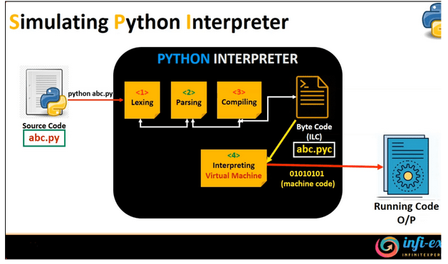

# Getting started with Python: Basic environment configuration

---

# Python Interpreter

- Python is an *interpreted* language
    - Programs are distributed as source code instead of binary machine code
    - An *interpreter* is required to run the program

- Python interpreters
    - [CPython](https://github.com/python/cpython) is the reference interpreter for the language ([📖](https://en.wikipedia.org/wiki/CPython))
    - [PyPy](https://pypy.org/) is a _just-in-time_ compiler Python with limited support for CPython extensions
    - [RustPython](https://rustpython.github.io/) is a Python interpreter written in Rust
    - [GraalPy](https://www.graalvm.org/python/) is part of [GraalVM](https://www.graalvm.org/)
    - Others/unmaintained: IronPython, Jython, [pyston](https://github.com/pyston/pyston)...
    - [Python Interpreters Benchmarks](https://pybenchmarks.org/)
    - Experimental compiler: [Nuitka]()

<!--
++++++++++++++++++++++++++++++++++++++++++++++++++++++++++++++++++++++++++++++
- Explain the concept of Python as an interpreted language
- Introduce the main Python interpreters
++++++++++++++++++++++++++++++++++++++++++++++++++++++++++++++++++++++++++++++

Python (created by Guido van Rossum in 1989-1991) is an interpreted language, which means that Python programs are not directly translated into binary machine code by the programming language processing tool (usually called *compiler*) at *compilation* time. Therefore, Python programs cannot be distributed as independent executable programs but only as source code files, and require the programming language processing tool (usually called *interpreter*) at run-time.

There are several Python interpreters developed in different programming languages, but the interpreter taken as reference implementation is CPython, written in C (originally used the C89 standard with several select C99 features, from version 3.11 it uses C11). CPython works by translating first the source code into bytecode (cached to the filesystem if possible) and then executing it by the Python stack virtual machine. Note that the bytecode is just an implementation detail and thus it's not guaranteed to be compatible across different versions.

RustPython:
    it can be embedded into Rust programs to use Python as a scripting language for your application, or it can be compiled to WebAssembly in order to run Python in the browser.
-->

---

# Python Interpreter

cPython




---

# CPython

- `python` | `python3` command
  - `python3` command was introduced to avoid conflicts with Python 2 since 3.x versions of the language were not backwards compatible
  - Python 2.x is end-of-life since 2020
  - Some Linux distributions still use `python3` (e.g. [Ubuntu](https://launchpad.net/ubuntu/focal/+package/python-is-python3)) as the executable
- `python` ...

<!-- ++++++++++++++++++++++++++++++++++++++++++++++++++++++++++++++++++++++++++++++
- Explain python vs python2 vs python3 commands
- Explain basic paths variables for the interpreter to find the distribution packages: PYTHONHOME, PYTHONPATH, PYTHONUSERBASE, PYTHONNOUSERSITE, ...
+++++++++++++++++++++++++++++++++++++++++++++++++++++++++++++++++++++++++++++++ -->
---

# CPython

```bash
$ python [options] [script.py]
```
- Usage:
  - script.py : execute script.py as main (adds basedir(script.py) to sys.path)
  - -c 'python_statement; python_statement;' : execute statements (adds PWD to sys.path)
  - -m pkg1.sub.module : run module as main (adds PWD to sys.path)

<!-- ++++++++++++++++++++++++++++++++++++++++++++++++++++++++++++++++++++++++++++++
- Explain cli python command options: -x, -u, -OO ,....
- Explain difference between python script.py and python -m script.py
++++++++++++++++++++++++++++++++++++++++++++++++++++++++++++++++++++++++++++++- -->
---

# Python Virtual Environments

- A virtual environment is a self-contained directory tree that contains a Python installation for a particular version of Python, plus a number of additional packages...
- ...that can be installed using the `pip` package manager
- Virtual environments make it easy to work on multiple projects with different dependencies
- Activating a virtual environment changes the shell's PATH to make the Python interpreter and the installed packages available

<!-- ++++++++++++++++++++++++++++++++++++++++++++++++++++++++++++++++++++++++++++++
- Explain what is a virtual environment
- Explain historic tools: virtualenv, venv, pyenv, ...
++++++++++++++++++++++++++++++++++++++++++++++++++++++++++++++++++++++++++++++- -->
---

# Environment management (seek for hands-on / interactive stuff for after lunch)

```bash
$ python -m venv myenv
$ which python
$ source myenv/bin/activate
$ which python
$ python -m pip list
$ python -m pip install --upgrade pip setuptools wheel
$ python -m pip install 'numpy==1.26.0'
$ python -m pip install 'numpy==2.1.0'
```

<!-- ++++++++++++++++++++++++++++++++++++++++++++++++++++++++++++++++++++++++++++++
* example of version clash if there's no venvs
* can you run different python/lib versions
- **EXERCISE**
- Create and activate an environment (to use in later exercises)
- Create 2 different environments with 1 python versions
++++++++++++++++++++++++++++++++++++++++++++++++++++++++++++++++++++++++++++++- -->
---

# Other Virtual Environments: Conda

- conda ...

<!-- ++++++++++++++++++++++++++++++++++++++++++++++++++++++++++++++++++++++++++++++
- Explain what is conda and how is different than python venv
    - binary dependencies are bundled with the package
- Explain conda/miniconda/micromamba clients
- Example of creating a conda venv
++++++++++++++++++++++++++++++++++++++++++++++++++++++++++++++++++++++++++++++- -->
---

# Other Virtual Environments: Spack

- spack ...
<!-- ++++++++++++++++++++++++++++++++++++++++++++++++++++++++++++++++++++++++++++++
- Explain what is conda and how is different than python venv
    - binary dependencies are bundled with the package
- Explain conda/miniconda/micromamba clients
- Example of creating a conda venv
++++++++++++++++++++++++++++++++++++++++++++++++++++++++++++++++++++++++++++++- -->
