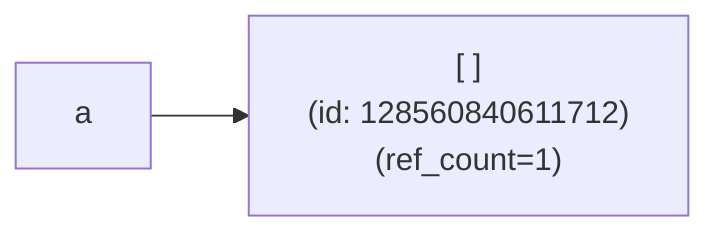
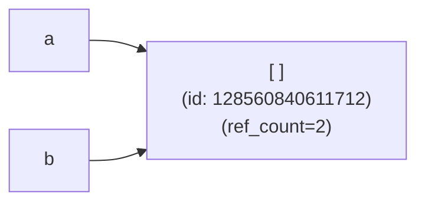
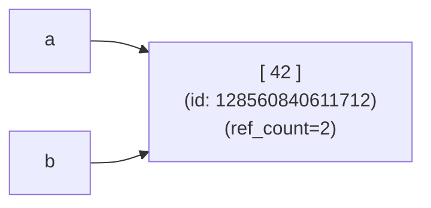
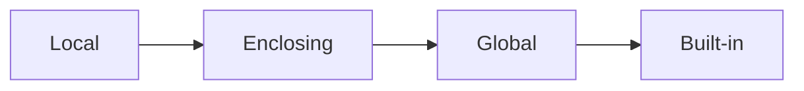

# Understanding Python for real:
# objects, attributes and imports

---

## Agenda

- Objects and variables
- Types and attributes
- Import system

---
layout: section
level: 2
---

# Objects and Variables

---

## Python Objects

What is an _object_ in Python?
<v-click>

_Everything!!_
- numbers (`int`, `float`), strings (`str`), collections (`list`,  `dict`), types (`type`), modules, ...

</v-click>
<v-click>

No, really, what is an _object_ in Python?
</v-click>

<v-click>

It is an abstraction for _"data"_ with:
- an unique, immutable identity (`id()`, `a is b` ~= `(id(a) == id(b)`)
  - (in CPython, this is the memory address)
- a type (`type()` ~= `a.__class__`)
- a value, usually just a _"namespace"_ or mapping from names to other _objects_
- (in CPython, it also has a reference count `>= 1`)
</v-click>

---
layout: two-cols
---
## Variables in Python

- A _variable_ (or _symbol_) in Python is just a name that points to an object
- Variable assignment only sets to which **existing** object the assigned name points to
- Multiple variables can point to the same object
  - Function arguments are the names inside the function scope for the passed objects
- Example:
  ```python
  a = []
  b = a
  a.append(42)   # a = [42] is NOT the same
  print(b)
  # [42]
  ```

::right::
<!-- step 1 -->
<v-click>
<div class="grid grid-cols-[25%_70%] gap-5 pt-4 -mb-6">
```python
a = []
```

</div>
</v-click>

<!-- step 2 -->
<v-click>
<div class="grid grid-cols-[25%_70%] gap-5 pt-10 ">
```python
b = a
```

</div>
</v-click>

<!-- step 2 -->
<v-click>
<div class="grid grid-cols-[25%_70%] gap-5 pt-4 -mb-6">
```python
a.append(42)
```

</div>
</v-click>

---

# Name Scopes

<div class="grid grid-cols-[40%_60%] gap-5 pt-10 ">

<div>

Python name resolution: **LEGB** rule

- **L**ocal (or function) scope
- **E**nclosing (or non-local) scope
- **G**lobal (or module) scope
- **B**uilt-in scope

Programmatic access to scopes:
- `globals()`: global symbol mapping
- `locals()`: **copy** of local mapping
  - at global scope == `globals()`
</div>
<div>



<br />
<br />

```python
x = 'global'        # Global scope

def outer():
    x = 'enclosed'  # Enclosing scope
    def inner():
        x = 'local' # Local scope
        print(x)    # Prints 'local'
    inner()
    print(x)        # Prints 'enclosed'

print(x)            # Prints 'global'
```
</div>
</div>

---

# Name Scopes for Modification: Question

What happens when modifying names from different scopes?

```python
global_name = 'global'

def outer():
    enclosed_name = 'enclosed'
    def inner():
        local_name = 'local'

        print(local_name)         # Prints 'local'
        local_name = 'NEW local'
        print(local_name)         # Prints ????

        print(enclosed_name)      # Prints 'enclosed'
        enclosed_name = 'NEW enclosed'
        print(enclosed_name)      # Prints ????

        print(global_name)        # Prints 'global'
        global_name = 'NEW global'
        print(global_name)         # Prints ????

    inner()

outer()
```
---

# Name Scopes for Modification: Playground

```python {monaco-run}
global_name = 'global'
def outer():
    enclosed_name = 'enclosed'
    def inner():
        local_name = 'local'
        print(local_name)         # Prints 'local'
        local_name = 'NEW local'
        print(local_name)         # Prints ????
        # non-local variable
        print(enclosed_name)      # Prints 'enclosed'
        enclosed_name = 'NEW enclosed'
        print(enclosed_name)      # Prints ????
        # global variable
        print(global_name)        # Prints 'global'
        global_name = 'NEW global'
        print(global_name)         # Prints ????

    inner()
#outer()
```

<!--
UnboundLocalError: local variable 'xxxx' referenced before assignment
-->
---

# Name Scopes for Modification: Solution

What happens when modifying names from different scopes?

- _Local_ variables can be always modified

- If a variable is assigned to in a function, it is **automatically** considered _local_ in that function

  - _Enclosed_ (_non-local_) variables need to be introduced with the `nonlocal` keyword to be _rebindable_

  - _Global_ (_module_) variables need to be declared as `global` keyword to be _rebindable_

<v-click>

- **Very important:** `global_var = 3 ` != `global_var.attr = 3`
</v-click>

---
layout: fact
---

## Exercises

Browse to: [https://github.com/eth-cscs/swe4py](https://github.com/eth-cscs/swe4py)

<br />

Open a code space and head to `exercises/1-2-understanding-python`
(need to be logged in)

or

Clone the repo & `cd swe4py/exercises/1-2-understanding-python`

---
layout: section
level: 2
---

# Types and Attributes

---

# Python Types (or Classes)

A Python _type_ or _class_ is just a Python object with some special properties

- A _class_ contains shared definitions for all objects referring to it (_instances_)
  - `type(instance) is MyClass` and (usually) `instance.__class__ is MyClass`
- A _class_ works as an object factory
  - `MyClass()` creates new instances: `MyClass().__class__ is MyClass`
- A _class_ customizes the behavior of its instances by defining `__dunder__` methods
  - `foo + bar` => `type(foo).__add__(foo, bar)` or `type(bar).__radd__(bar, foo)`
- A _class_ may delegate / extend its content from other types through (multiple) inheritance
  - `class SubClass(ParentClassA, ParentClassB): ...`
  - **M**ethod **R**esolution **O**rder (MRO) is defined by the [C3 linearization](https://en.wikipedia.org/wiki/C3_linearization) of its bases: `cls.__mro__`
- Changing the methods of a class dynamically alters the behavior of all its instances (_"monkey patching"_ )
- _Note: the class of a class (its "metaclass") is also a class_

<!--
Types affect almost all aspects of object behavior. Even the importance of object identity is affected in some sense: for immutable types, operations that compute new values may actually return a reference to any existing object with the same type and value, while for mutable objects this is not allowed. For example, after a = 1; b = 1, a and b may or may not refer to the same object with the value one, depending on the implementation. This is because int is an immutable type, so the reference to 1 can be reused. This behaviour depends on the implementation used, so should not be relied upon, but is something to be aware of when making use of object identity tests. However, after c = []; d = [], c and d are guaranteed to refer to two different, unique, newly created empty lists. (Note that e = f = [] assigns the same object to both e and f.)

A _class_ may have a _metaclass_ that defines how the class is created.
-->
---

# Object Model

- Relationships between _objects_ and _types_


---

# `__dunder__` (or _Magic_) Methods

- Special methods that customize object behavior:

  ```python
  class Vector:
      def __init__(self, x, y):
          self.x = x
          self.y = y

      def __add__(self, other):
          return Vector(self.x + other.x, self.y + other.y)

      def __str__(self):
          return f"Vector({self.x}, {self.y})"

  v1 = Vector(1, 2)
  v2 = Vector(3, 4)
  print(v1 + v2)  # Vector(4, 6)
  ```
- Defined on the **type of the object**, not the object itself
- [Full list of special methods](https://docs.python.org/3/reference/datamodel.html#special-method-names)
---

# Object Attributes

- Attributes are just symbols defined within the _namespace_ of a specific object
  ```python
  a = Person()
  print(a.income)                       # Attribute access
  a.name = "Alice"                      # Attribute assignment
  print(a.age - Person.RETIREMENT_AGE)  # Attribute access on instance and class
  print(a.__class__)                    # Attribute access to a magic name
  print(a.__class__.__name__)           # Attribute access on instance and class
  a.send_email("Hello!")                # Attribute access on instance and class: a.__class__.send_email(a, "Hello!")
  ```

- **Intuition**: `object`s (usually) store all their attributes in a bare `dict`: `instance.__dict__`, `vars(instance)`
  ```python
  a.b ~= a.__dict__['b'] ~= vars(a)['b']
  ```
  - Although it is not required and some kind of objects never have a `__dict__` (e.g. builtins, slotted objects, cpython extension types, ...)

<v-click>

_"Wait, does this mean that an attribute access actually requires a hash map lookup??!"_  😂😂
</v-click>

---

# Object Attributes Visibility

Nothing is truly private in Python!

- Python has no true private attributes - only naming conventions
```python
class MyClass:
    def __init__(self):
        self.public = "Hello!"
        self._protected = "I'm 'protected' by usage convention"
        self.__private = "I'm name-mangled"

obj = MyClass()
print(obj.public)               # Works fine
print(obj._protected)           # Works fine too!
print(obj._MyClass__private)    # Obfuscation by name-mangling but still accessible!
```

- There is nothing you can really do about it, so **embrace it!**
  - Follow usage conventions and don't access `_underscored` attributes of other objects
  - Don't rely on privacy for security
  - _"We're all consenting adults here"_


---

# Dynamic Object Attributes: `@property`

<div class="grid grid-cols-[50%_50%] gap-5">

- Properties work as _attributes_ computed on-the-fly. `@property` is a builtin _decorator_
    ```python
    class Circle:
        def __init__(self, radius):
            self.radius = radius

        @property
        def area(self):
            return 3.14 * self.radius ** 2

    c = Circle(5)
    print(c.area)  # 78.5
    ```

<div>

- `@property.setter` and `@property.deleter` can be used to define _setter_ and _deleter_ methods
```python
class Circle:
    def __init__(self, radius):
        self.radius = radius

    @property
    def area(self):
        return 3.14 * self.radius ** 2

    @area.setter
    def area(self, value):
        self.radius = (value / 3.14) ** 0.5
```
</div>
</div>

<v-click>

- It works by means of the [Descriptor Protocol](https://docs.python.org/3/howto/descriptor.html) (`__get__()`, `__set__()`, `__delete__`) which allows running user-defined _hooks_ in attribute accesses
- ``@property`` is a _descriptor_ that defines custom _getter_ / _setter_ hooks for a specific attribute ([pseudocode](https://docs.python.org/3/howto/descriptor.html#properties))
</v-click>

---

# Attribute Access == Function Call

Actually, all attribute accesses in Python are **calls** to _magic methods_

<v-click>

- `obj.attr` is equivalent to `type(obj).__getattribute__(obj, 'attr')`

</v-click>
<v-click>
<div>

- `obj.attr = value` is equivalent to `type(obj).__setattr__(obj, 'attr', value)`
  - Note that this is **completely different** than `name = value`
  - How? Why?

</div>
</v-click>
<v-click>

- `del obj.attr` is equivalent to `type(obj).__delattr__(obj, 'attr')`

</v-click>
<v-click>

- Default behavior is implemented in `object.__getattribute__()`, `object.__setattr__()`, `object.__delattr__()`

</v-click>
<v-click>
<div>

- There is also a _fallback_ `obj.__getattr__(self, attr)` magic method:
  - `__getattr__(self, attr)` is only called if `attr` hasn't been found through a regular lookup
  - `__getattribute__(self, attr)` is *always* called for every attribute access
    - very easy to create infinite recursion calls in custom definitions
</div>
</v-click>

---

# Attribute Access: Putting Everything Together

- Default `object.__getattribute__(instance, attr)`: <[flow chart](slides/1.2-understanding-python/assets/object-attribute-lookup-v3.png)>
  ```python
  def __getattribute__(self: object, attr: str) -> Any:
      cls = type(self)
      value = NameNotFoundSpecialMarker             # special marker value for this pseudocode example
      if attr in cls.__dict__:                      # see `type.__getattribute__()` below
          value = cls.__dict__[attr]
          if is_data_descriptor(value):             # value found in class is a data descriptor
              return value.__get__(self, cls)
      if attr in self.__dict__:
          return self.__dict__[attr]
      if value is not NameNotFoundSpecialMarker:
          if is_non_data_descriptor(value):         # value found in class is a non-data descriptor
              return value.__get__(self, cls)
          else:
              return value                          # value found in class is a normal object
      return cls.__getattr__(self, attr)
  ```
<v-click>

- `type.__getattribute__(obj, attr)`:
  - looks for `attr` in all `__mro__` items in reverse order
</v-click>

---

# Attributes in Python: Summary

- Object attributes are just names in the object's namespace
- There is no true privacy in Python
- Attribute access is a complex process and can be fully customized
  - At class level via custom _magic methods_
  - At attribute level via _descriptors_ (e.g. `@property`, `@cachedproperty`, ...)
- **Embrace** the dynamic nature of Python!

---
layout: fact
---

## Exercises

Browse to: [https://github.com/eth-cscs/swe4py](https://github.com/eth-cscs/swe4py)

<br />

Open a code space and head to `exercises/1-2-understanding-python`
(need to be logged in)

or

Clone the repo & `cd swe4py/exercises/1-2-understanding-python`

---
layout: section
level: 2
---

# The Import System

---

# Modules

- A _module_ in Python is a namespace containing objects (functions, classes, variables):
  - from a single Python file (e.g. `my_module.py`)
  - created by executing the source file **only once** when first imported
  - cached for subsequent imports (in `sys.modules`)
  ```python
  ## -- my_module.py --
  print("This gets executed on import")

  MY_CONSTANT = 42

  def hello():
      return "Hello from my_module!"

  ## -- main.py --
  import my_module  # Prints "This gets executed on import"
  import my_module  # No output - already imported!
  ```
---

# Packages: Modules in Directories

- A _package_ is a module which contains other modules:
  - created from a directory containing Python modules
  - the package namespace is initially created by executing the special `__init__.py` file in the directory
  - can contain subpackages (nested directories)
  ```
  my_package/
  │
  ├── __init__.py
  ├── module1.py
  ├── module2.py
  │
  └── subpackage/
      ├── __init__.py
      └── module3.py
  ```

---

# Imports

- _Imports_ are the Python mechanism to access symbols from other modules

<div class="grid grid-cols-[50%_50%] gap-2">
<div>

- The `import` statement
  - loads a module and binds it to a name in the current namespace
  - executes the module code if not already imported
- The `importlib` standard library module
  - provides the implementation of the `import` statement (`importlib.__import__()`)
  - provides low-level tools for handling imports
</div>

```python
import math                   # Import the math module
math.sqrt(16)                 # 4.0

from math import sqrt, pi     # Import specific symbols
sqrt(16)                      # 4.0

import numpy as np            # Import with an alias
np.array([1, 2, 3])
```
</div>

---

# Import Algorithm: Simple Version for Modules

```python
import my_module    # as alias
```
<v-click>

1. Check if `my_module` is in `sys.modules`
    - Dictionary mapping module names to module objects (module cache)
    - Can be (**carefully**) modified at runtime: `del sys.modules['module_name']`
</v-click>
<v-click>

2. If not, find the module code (`my_module.py`) in the `sys.path` items
    - List of directories where Python looks for module.
    - Usually: `basedir(__main__.py) : $PYTHONPATH : <standard-library> : <site-packages>`
    - Can be (**carefully**) modified at runtime: `sys.path.append('/path/to/my/modules')`
</v-click>
<v-click>

3. Create a new module object and load the module code (`exec(read('my_module.py'))`)
</v-click>
<v-click>

4. Store the loaded module object in `sys.modules`
</v-click>
<v-click>

5. Return the loaded module and **bind it to the name `my_module` in the current namespace** (or `alias`)
</v-click>

---

# Import Algorithm for Packages

<div class="grid grid-cols-[50%_50%] gap-5">
<div>
```python
import my_package       # as alias
```
```
my_package/
│
├── __init__.py
├── module1.py
├── module2.py
│
└── subpackage/
    ├── __init__.py
    └── module3.py
```
</div>

<div>
<v-click>

1. Check if `my_package` is in `sys.modules`
</v-click>
<v-click>

2. If not, find the package code (`my_package/__init__.py`) in the `sys.path` items
</v-click>
<v-click>

3. Create a new package object and load the `my_package/__init__.py` code
</v-click>
<v-click>

4. Store the loaded package object in `sys.modules`
</v-click>
<v-click>

5. Return the loaded package and bind it to the name `my_package` (or `alias`) in the current namespace
</v-click>
</div>
</div>

---

# Import Algorithm for Subpackages

<div class="grid grid-cols-[45%_58%] gap-2">
<div>
```python
import my_package.module1   # as alias
```
```
my_package/
│
├── __init__.py
├── module1.py
├── module2.py
│
└── subpackage/
    ├── __init__.py
    └── module3.py
```
</div>

<div>
<v-click>

1. Check if `my_package.module1` is in `sys.modules`
</v-click>
<v-click>

2. If not, **import the `my_package` package** using the previous algorithm
</v-click>
<v-click>

3. Find the module code (`my_package/module1.py`) in the `sys.path` items
</v-click>
<v-click>

4. Create a new module object and load the `my_package/module1.py` code
</v-click>
<v-click>

5. Store the loaded module object in `sys.modules` with the full name `my_package.module1`
</v-click>
<v-click>

6. Return the loaded module and bind it to the name `module1` in the `sys.modules['my_package']` namespace
    - If `as alias` is used, bind it to the name `alias` in the current namespace too

</v-click>
</div>
</div>

---

# Selective `from A import B`

- Allows importing only specific symbols from a module
- Roughly equivalent to:
<div class="grid grid-cols-[48%_50%] gap-2">
<div>

```python
from my_package.subpackage.module3 import foo as f
```
</div>
<div>

```python
_my_package_in_scope = "my_package" in globals()
import my_package.subpackage.module3
f = my_package.subpackage.module2.foo   # <==== !!!
if not _my_package_in_scope:
    del my_package
del _my_package_in_scope
```
</div>
</div>

- It also supports relative imports
```python
# __package__ = "root.branch"
from . import a             # from root.branch import a
from .foo import bar        # from root.branch.foo import bar
from ..baz import module    # from root.baz import module
```

  - assert that the current module is inside a **package**
  - resolve `.` to the package in which the current module is located
  - resolve `..` to the parent **package**

---

# Circular Imports

<div class="grid grid-cols-[50%_50%] gap-2">
<div>

- A _circular import_ occurs when two or more modules depend on each other
- Dealing with _partially initialized_ modules
  - `ImportError` or unexpected `AttributeError`

Solutions:
- Restructure your code 👍
- Move imports inside functions
- Import where needed, not at the top 👎
  - only if necessary

</div>
<div>

```python
## -- a.py --
import b

CONSTANT_A = 42

def function_a(x):
    return b.function_b(x) + 1

## -- b.py --
import a

CONSTANT_B = a.CONSTANT_A + 10  # Undefined 'a.CONSTANT_A'

def function_b(x):
    # CONSTANT_B = a.CONSTANT_A + 10  # Here is ok
    return x + CONSTANT_B

## -- main.py --
import b
print(b.function_b(1))
```
</div>
</div>


---
layout: fact
---

## Exercises

Browse to: [https://github.com/eth-cscs/swe4py](https://github.com/eth-cscs/swe4py)

<br />

Open a code space and head to `exercises/1-2-understanding-python`
(need to be logged in)

or

Clone the repo & `cd swe4py/exercises/1-2-understanding-python`
