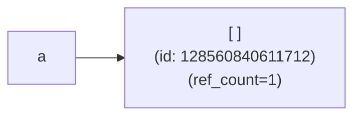
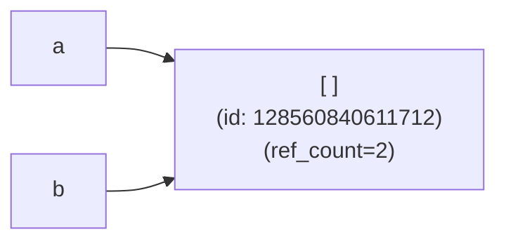
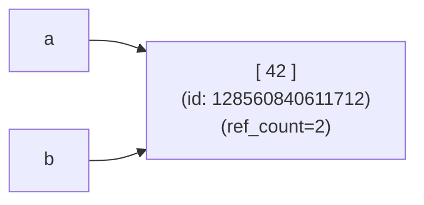
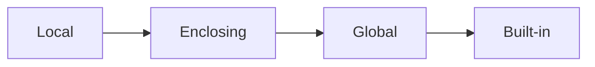

# Understanding Python for real:
# objects, attributes and imports

---

## Agenda

- Objects and variables
- Types and attributes
- Import system

---
layout: section
level: 2
---

# Objects and Variables

---

## Python Objects

What is an _object_ in Python?
<v-click>

_Everything!!_
- numbers (`int`, `float`), strings (`str`), collections (`list`,  `dict`), types (`type`), modules, ...

</v-click>
<v-click>

No, really, what is an _object_ in Python?
</v-click>

<v-click>

It is an abstraction for _"data"_ with:
- an unique, immutable identity (`id()`, `a is b` ~= `(id(a) == id(b)`)
  - (in CPython, this is its memory address)
- a type (`type()` ~= `a.__class__`)
- a value, usually just a _"namespace"_ or mapping from names to other _objects_
- (in CPython, it also has a reference count `>= 1`)
</v-click>

---
layout: two-cols
---
## Variables in Python

- A _variable_ (or _symbol_) in Python is just a name that points to an object
- Variable assignment only sets to which **existing** object the assigned name points to
- Multiple variables can point to the same object
  - Function arguments are the names inside the function scope for the passed objects
- Example:
  ```python
  a = []
  b = a
  a.append(42)   # a = [42] is NOT the same
  print(b)
  # [42]
  ```

::right::
<!-- step 1 -->
<v-click>
<div class="grid grid-cols-[25%_70%] gap-5 pt-4 -mb-6">
```python
a = []
```

</div>
</v-click>

<!-- step 2 -->
<v-click>
<div class="grid grid-cols-[25%_70%] gap-5 pt-10 ">
```python
b = a
```

</div>
</v-click>

<!-- step 2 -->
<v-click>
<div class="grid grid-cols-[25%_70%] gap-5 pt-4 -mb-6">
```python
a.append(42)
```

</div>
</v-click>

---

# Name Scopes

<div class="grid grid-cols-[40%_60%] gap-5 pt-10 ">

<div>

Python name resolution: **LEGB** rule

- **L**ocal (or function) scope
- **E**nclosing (or non-local) scope
- **G**lobal (or module) scope
- **B**uilt-in scope

Programmatic access to scopes:
- `globals()`: global symbol mapping
- `locals()`: **copy** of local mapping
  - at global scope == `globals()`
</div>
<div>



<br />
<br />

```python
x = 'global'        # Global scope

def outer():
    x = 'enclosed'  # Enclosing scope
    def inner():
        x = 'local' # Local scope
        print(x)    # Prints 'local'
    inner()
    print(x)        # Prints 'enclosed'

print(x)            # Prints 'global'
```
</div>
</div>

---

# Name Scopes for Modification: Question

What happens when modifying names from different scopes?

```python
global_name = 'global'

def outer():
    enclosed_name = 'enclosed'
    def inner():
        local_name = 'local'

        print(local_name)         # Prints 'local'
        local_name = 'NEW local'
        print(local_name)         # Prints ????

        print(enclosed_name)      # Prints 'enclosed'
        enclosed_name = 'NEW enclosed'
        print(enclosed_name)      # Prints ????

        print(global_name)        # Prints 'global'
        global_name = 'NEW global'
        print(global_name)         # Prints ????

    inner()

outer()
```
---

# Name Scopes for Modification: Playground

```python {monaco-run}
global_name = 'global'
def outer():
    enclosed_name = 'enclosed'
    def inner():
        local_name = 'local'
        print(local_name)         # Prints 'local'
        local_name = 'NEW local'
        print(local_name)         # Prints ????
        # non-local variable
        print(enclosed_name)      # Prints 'enclosed'
        enclosed_name = 'NEW enclosed'
        print(enclosed_name)      # Prints ????
        # global variable
        print(global_name)        # Prints 'global'
        global_name = 'NEW global'
        print(global_name)         # Prints ????

    inner()
#outer()
```

<!--
UnboundLocalError: local variable 'xxxx' referenced before assignment
-->
---

# Name Scopes for Modification: Solution

What happens when modifying names from different scopes?

- _local_ variables can be always modified

- _enclosed_ / _non-local_ variables need to be introduced with the `nonlocal` keyword to be _rebindable_

- _global_ / _module_ variables need to be declared as `global` keyword to be _rebindable_

---
layout: fact
---

## Exercises

Browse to: [https://github.com/eth-cscs/swe4py](https://github.com/eth-cscs/swe4py)

<br />

Open a code space and head to `exercises/1-2-understanding-python`
(need to be logged in)

or

Clone the repo & `cd swe4py/exercises/1-2-understanding-python`

---
layout: section
level: 2
---

# Types and Attributes

---

# Python Types (or Classes)

A Python _type_ or _class_ is just a Python object with some special properties

- A _class_ contains shared definitions for all objects referring to it (_instances_)
  - `type(instance) is MyClass` and (usually) `instance.__class__ is MyClass`
- A _class_ works as an object factory
  - `MyClass()` creates new instances: `MyClass().__class__ is MyClass`
- A _class_ customizes the behavior of its instances by defining `__dunder__` methods
  - `foo + bar` => `type(foo).__add__(foo, bar)` or `type(bar).__radd__(bar, foo)`
- A _class_ may delegate / extend its content from other types through (multiple) inheritance
  - `class SubClass(ParentClassA, ParentClassB): ...`
  - **M**ethod **R**esolution **O**rder (MRO) is defined by the [C3 linearization](https://en.wikipedia.org/wiki/C3_linearization) of its bases: `cls.__mro__`
- Changing the methods of a class dynamically alters the behavior of all its instances (_"monkey patching"_ )
- _Note: the class of a class (its "metaclass") is also a class_

<!--
Types affect almost all aspects of object behavior. Even the importance of object identity is affected in some sense: for immutable types, operations that compute new values may actually return a reference to any existing object with the same type and value, while for mutable objects this is not allowed. For example, after a = 1; b = 1, a and b may or may not refer to the same object with the value one, depending on the implementation. This is because int is an immutable type, so the reference to 1 can be reused. This behaviour depends on the implementation used, so should not be relied upon, but is something to be aware of when making use of object identity tests. However, after c = []; d = [], c and d are guaranteed to refer to two different, unique, newly created empty lists. (Note that e = f = [] assigns the same object to both e and f.)

A _class_ may have a _metaclass_ that defines how the class is created.
-->
---

# Object Model

- Relationships between _objects_ and _types_


---

# `__dunder__` (or _Magic_) Methods

- Special methods that customize object behavior:

  ```python
  class Vector:
      def __init__(self, x, y):
          self.x = x
          self.y = y

      def __add__(self, other):
          return Vector(self.x + other.x, self.y + other.y)

      def __str__(self):
          return f"Vector({self.x}, {self.y})"

  v1 = Vector(1, 2)
  v2 = Vector(3, 4)
  print(v1 + v2)  # Vector(4, 6)
  ```
- Defined on the **type of the object**, not the object itself
- [Full list of special methods](https://docs.python.org/3/reference/datamodel.html#special-method-names)
---

# Object Attributes

- Attributes are just symbols defined within the _namespace_ of a specific object
  ```python
  a = Person()
  print(a.income)                       # Attribute access
  a.name = "Alice"                      # Attribute assignment
  print(a.age - Person.RETIREMENT_AGE)  # Attribute access on instance and class
  print(a.__class__)                    # Attribute access to a magic name
  print(a.__class__.__name__)           # Attribute access on instance and class
  a.send_email("Hello!")                # Attribute access on instance and class: a.__class__.send_email(a, "Hello!")
  ```

- **Intuition**: `object`s (usually) store all their attributes in a bare `dict`: `instance.__dict__`, `vars(instance)`
  ```python
  a.b ~= a.__dict__['b'] ~= vars(a)['b']
  ```
  - Although it is not required and some kind of objects never have a `__dict__` (e.g. builtins, slotted objects, cpython extension types, ...)

<v-click>

_"Wait, does this mean that an attribute access actually requires a hash map lookup??!"_
</v-click>

---

# Object Attributes Visibility

Nothing is truly private in Python!

- Python has no true private attributes - only naming conventions
```python
class MyClass:
    def __init__(self):
        self.public = "Hello!"
        self._protected = "I'm 'protected' by usage convention"
        self.__private = "I'm name-mangled"

obj = MyClass()
print(obj.public)               # Works fine
print(obj._protected)           # Works fine too!
print(obj._MyClass__private)    # Obfuscation by name-mangling but still accessible!
```

- There is nothing you can really do about it, so **embrace it!**
  - Follow usage conventions and don't access `_underscored` attributes of other objects
  - Don't rely on privacy for security
  - _"We're all consenting adults here"_

---

# Attribute Access == Function Call

In Python, attribute accesses are **really** calls to _magic methods_

<v-click>

- `obj.attr` is equivalent to `type(obj).__getattribute__(obj, 'attr')`

</v-click>
<v-click>
<div>

- `obj.attr = value` is equivalent to `type(obj).__setattr__(obj, 'attr', value)`
  - Note that this is **completely different** than `name = value`

</div>
</v-click>
<v-click>

- `del obj.attr` is equivalent to `type(obj).__delattr__(obj, 'attr')`

</v-click>
<v-click>

- Default behavior is implemented in `object.__getattribute__()`, `object.__setattr__()`, `object.__delattr__()`

</v-click>
<v-click>
<div>

- There is also a _fallback_ `obj.__getattr__(self, attr)` magic method:
  - `__getattr__(self, attr)` is only called if `attr` hasn't been found through a regular lookup
  - `__getattribute__(self, attr)` is *always* called for every attribute access
    - very easy to create infinite recursion calls in custom definitions
</div>
</v-click>


---

# Attribute Lookup In Detail

- Default `object.__getattribute__(instance, attr)`: ([flow chart](slides/1.2-understanding-python/assets/object-attribute-lookup-v3.png), [Descriptor Protocol](https://docs.python.org/3/howto/descriptor.html))
  ```python
  def __getattribute__(self, attr):
      cls = type(self)
      value = NameNotFoundSpecialMarker             # special marker value
      if attr in cls.__dict__:
          value = cls.__dict__[attr]
          if is_data_descriptor(value):             # value found in class is a data descriptor
              return value.__get__(self, cls)
      if attr in self.__dict__:
          return self.__dict__[attr]
      if value is not NameNotFoundSpecialMarker:
          if is_non_data_descriptor(value):         # value found in class is a non-data descriptor
              return value.__get__(self, cls)
          else:
              return value
      return cls.__getattr__(self, attr)
  ```
<v-click>

- `type.__getattribute__(obj, attr)`:
  - looks for `attr` in all `__mro__` items in reverse order
</v-click>

---

# Attributes in Python: Summary

- Object attributes are just names in the object's namespace
- There is no true privacy in Python
- Attribute access is a complex process that can be fully customized
  - Per class via _magic methods_
  - Per attribute via _descriptors_
- **Embrace** the dynamic nature of Python!

---
layout: fact
---

## Exercises

Browse to: [https://github.com/eth-cscs/swe4py](https://github.com/eth-cscs/swe4py)

<br />

Open a code space and head to `exercises/1-2-understanding-python`
(need to be logged in)

or

Clone the repo & `cd swe4py/exercises/1-2-understanding-python`

---
layout: section
level: 2
---

# Import System

---

# Import Mental Model

- Imports load code into memory
- Dependencies are automatically handled
- Modules are cached in `sys.modules`

```python
import delorean  # Also imports pytz, python-dateutil

# Different import styles
import module                 # Use: module.name
from module import name      # Use: name
from module import name as alias  # Use: alias
```

---

# Import Side Effects

```python
# In module.py
print("I run on import!")
x = 42

def main():
    print("I only run if executed directly")

if __name__ == "__main__":
    main()
```

Avoid `from module import *`:
- Pollutes namespace
- Makes dependencies unclear
- Can overwrite existing names

---

# EXERCISE: Import Problems

1. Spot the problem:
```python
# main.py
from utils import helper
# utils.py
from main import app
```

2. Monkey Patching Difference:
```python
# Version 1
import math
math.pi = 3  # Changes for all users of math

# Version 2
from math import pi
pi = 3  # Only changes local name
```
