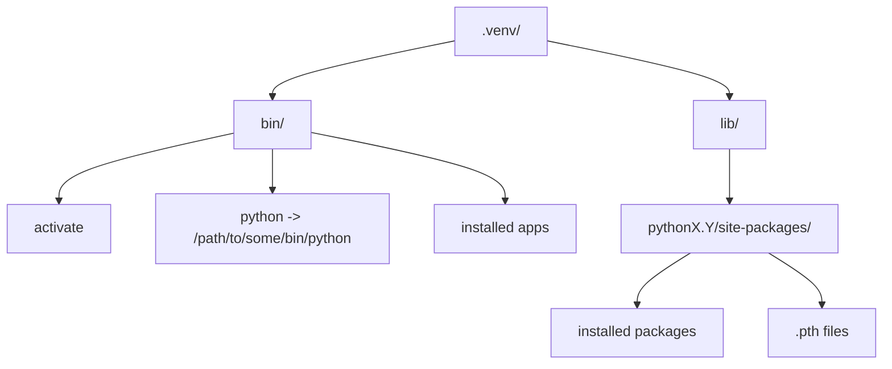
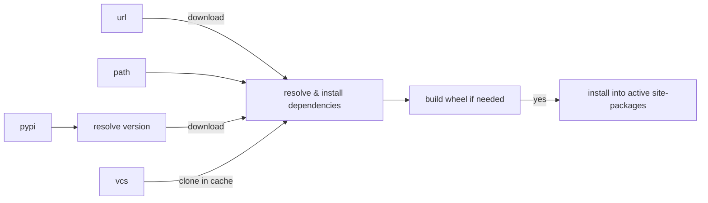

# Environments & Package Installs

---

## What We Will Learn

- Virtualenv Gotchas
- Why are environments not movable?
- What does a Package install do?
- Where can Packages come from?

---

## Gotchas

### 1. Package Managers

---

Does this work?

```bash
$ conda activate apple

(apple) $ pip install numpy
```
<v-click>

😄 Yes!
</v-click>

---

How about this?
```bash
$ source orange/bin/activate

(orange) $ conda install tensorflow
```

<v-click>

```bash {5}
Retrieving notices: ...working... done
...
## Package Plan ##
  environment location: /opt/anaconda3
```

Installs into base conda environment 😢
Why?

</v-click>

---
layout: fact
---

Conda Env

&ne;

Virtualenv

---

What about this?
```bash
$ spack activate bananas
(bananas) $ spack install py-pip

(bananas) $ pip install numpy
```

<v-click>

<a href="https://github.com/spack/spack/issues/28282">Used to install into system environment in 2023 😢</a>

Also, pip might "upgrade" python packages you installed with spack.
</v-click>

---

But this works!

```bash
$ source venv/bin/activate
(venv) $ pip install uv
(venv) $ uv pip install jupyterlab
```

And `uv pip` is a lot faster.

They are both Python Package Managers

---

## Gotchas

### 2. Where Is My Package?

---

Work on Project A
```bash
project_a $ source .venv/bin/activate
(.venv) project_a $ pip install rich, numpy
```
<v-click>

Work on Project B
```bash
(.venv) project_a $ deactivate
project_a $ cd ../project_b
(.venv) project_b $ source .venv/bin/activate
(.venv) project_b $ pip install numpy
```
</v-click>
<v-click>

Return to Project A
````md magic-move
```bash
(.venv) project_b $ cd ../project_a
(.venv) project_a $ python -c "import rich, numpy; rich.print(numpy.array([1, 2, 3]))"
raceback (most recent call last):
  File "<string>", line 1, in <module>
    import rich, numpy
ModuleNotFoundError: No module named 'rich'
```

```bash
(.venv) project_b $ deactivate
(.venv) project_b $ cd ../project_a && source .venv/bin/deactivate
(.venv) project_a $ python -c "import rich, numpy; rich.print(numpy.array([1, 2, 3]))"
[1 2 3]
```

````
</v-click>

---

How to not forget?

<v-click>

- Use `direnv` to automatically activate & deactivate
</v-click>
<v-click>

- Teach your IDE which env for which project (& never leave the IDE)
</v-click>
<v-click>

- Use `uv`, `hatch` or `pdm` to work on projects

```bash
project_a $ uv add rich, numpy
project_a $ cd ../project_b
project_b $ uv add numpy
project_b $ cd ../project_a
project_a $ uv run python -c "import rich, numpy; rich.print(numpy.array([1, 2, 3]))"
[1 2 3]
```

(This requires your projects to have a `pyproject.toml` file)
</v-click>

---

## Gotchas
### 3. Venvs Don't Stack

---

Activate "thisenv"
```bash
$ source thisenv/bin/activate
```
<v-click>
Activate "otherenv"
```bash
(thisenv) $ source otherenv/bin/activate
```
</v-click>
Deactivate "otherenv"
<v-click>
```bash
(otherenv) $ deactivate
```
</v-click>
<v-click>
```bash
$ which python
  #NOT thisenv/bin/python
```
</v-click>

---

## Anatomy Of A Virtualenv




---

## Anatomy Of A Package Install

```bash
(venv)$ pip install <mylib>
```

1. Determine source

- PyPi: `mylib`
  - try relative path if not found
- relative path: `./mylib`
- url: `https:\//.../mylib.tar.gz`
- vcs: `mylib@git+https:\//github.com/DropD/mylib`

---

## Anatomy Of A Package Install

```bash
(venv)$ pip install <mylib>
```

2. Pick version, resolve dependencies, install



<v-click>
<a href="https://peps.python.org/pep-0650/">Installer (PEP 650)</a>
<Arrow x1="120" y1="400" x2="400" y2="300" />
</v-click>

<v-click>
 ➟ <a href="https://peps.python.org/pep-0518/"> Build Frontend (PEP 518)</a>
<Arrow x1="420" y1="400" x2="600" y2="300" />
</v-click>

<v-click>
 ➟ <a href="https://peps.python.org/pep-0517/"> Build Backend (PEP 517)</a>
<Arrow x1="620" y1="400" x2="650" y2="300" />
</v-click>

<v-click>
 ➟ <a href="https://peps.python.org/pep-0650/">Installer (PEP 650)</a>
<Arrow x1="820" y1="400" x2="840" y2="300" />
</v-click>

---
layout: fact
---

## Exercises

Time to see it in action: Browse to

<br />
<a href="https://github.com/eth-cscs/swe4py">https://github.com/eth-cscs/swe4py</a>

<br />
<br />

Open a code space and head to `exercises/1-3-build-install`
(need to be logged in)

or

Clone the repo & cd to `exercises/1-3-build-install`
