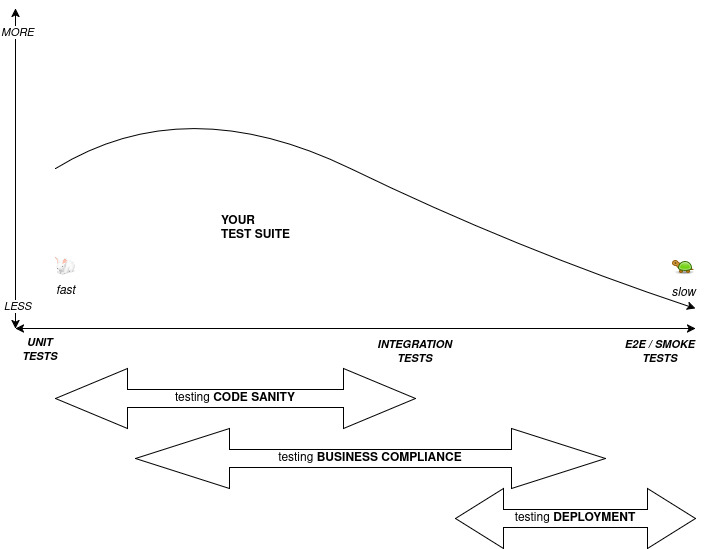

# Testing

---
layout: full
---

# Overview

<v-click>

## **Principles**

        1. Testing WHAT?
        2. WHY bother testing?
        3. Testing HOW?

</v-click>
<v-click>

## **Concepts**

        4. Testing Workflow
        5. Testing Frameworks
        6. Testing Features

</v-click>
<v-click>

## **Practices**

        7. Common Pitfalls
        8. Good Practices

</v-click>

---

# Testing WHAT?

Different Targets

<v-click>

1. **Code**

        (e.g. it doesn't break)

</v-click>
<v-click>

2. **Requirements**

        (e.g. business is happy)

</v-click>
<v-click>

3. **Environments**

        (e.g. deployment to prod works!)

</v-click>
<v-click>

4. **Data**

        (e.g. dataset is statistically reasonable)

</v-click>

<!--

1. Is code getting slower? is memory usage worse? is coverage good enough? public interface respected?
2. Is code doing what is expected from it?
3. Code is fine, business is happy, but will this work when deployed in production?
4. Statistical testing for datasets

-->

---

# WHY bother testing?

3 Reasons

<v-click>

1. To catch **bugs**

        (proves existence, not lack thereof!)

</v-click>
<v-click>

2. To increase developer **confidence**

        (promotes refactoring, hence clean code)

</v-click>
<v-click>

3. To **share understanding** among engineering team

        (becomes a form of living documentation)

</v-click>

<!--
Understanding your testing suite keeps you connected to your business. Becomes critical in times of "AI vibe coding".
-->

---

# Testing HOW?

Empirically

Unlike **Static Analysis** and **Formal Verification** approaches...

... testing is more **EMPIRICAL** and less **FORMAL**.

[https://se.inf.ethz.ch/~meyer/publications/testing/principles.pdf](https://se.inf.ethz.ch/~meyer/publications/testing/principles.pdf)

<v-click>

        - Business wants to stop spending, regardless of testing

        - Testing should stop when business stops, not earlier

</v-click>

---

# Testing HOW?

Automatically

<v-click>

If testing is informal ...

</v-click>
<v-click>

Manual testing is rude.

</v-click>
<v-click>

No testing is savage.

</v-click>

---

# Testing HOW?

Pragmatically

<Transform :scale="0.69">



</Transform>

---

# Testing **Workflow**

- The **Test Driver**

- The **Feedback Loop**


---

# Test Driver

(Testing Workflow)

The process driving the testing framework could be ...

<Transform :scale="0.8">

<v-click>

- `python custom_testing_logic.py`

        - A plain python process, old, not cool anymore

</v-click>
<v-click>

- `pytest`

        - Works like a charm, specially from PyCharm

</v-click>
<v-click>

- `nox`

        - Multi-python-environment testing

</v-click>
<v-click>

- `containerized shell`

        - Multi-environment testing

</v-click>
<v-click>

- `ci/cd`

        - Already vendor-tainted

</v-click>

</Transform>

---

# Feedback Loop

(Testing Workflow)

For each new test for a new feature or bugfix, you should experience this

```mermaid
stateDiagram
    direction LR
    classDef testPass color:green,stroke-width:2px
    classDef testFail color:red,stroke-width:2px

    [*] --> pass_tests:::testPass : git pull
    pass_tests --> fail_new:::testFail : implement new test
    fail_new --> pass_new:::testPass : implement new code
    pass_new --> pass_tests_again:::testPass
    pass_new --> pass_new_again:::testPass : (optional) refactor code and/or test
    pass_new_again --> fail_new_again:::testFail : comment implementation
    fail_new_again --> pass_tests_again:::testPass : uncomment implementation
    pass_tests_again --> [*] : git push

```



Note:

`pass_tests`

        - at least for the project "modules" you'll work on

`git push`

        - your CI/CD pipeline would run the rest of the test suite

<!-- should state diagram invert state / transition elements? -->

---

# Testing **Frameworks**

1. **[doctest](https://docs.python.org/3/library/doctest.html)**

        - nice for python coding interviews ;)

2. **[unittest](https://docs.python.org/3/library/unittest.html)**

        - great python builtin

3. **[pytest](https://docs.pytest.org/en/stable/index.html)**

        - makes testing fun again

---
layout: two-cols-header
---

# doctest

(Testing Frameworks)

::left::

Example

<Transform :scale="0.7">
```python
# factorial.py
def factorial(n):
        """
        Returns the factorial of a number.

        >>> factorial(5)
        120
        >>> factorial(0)
        1
        >>> factorial(3)
        6
        """
        if n == 0:
                return 1
        else:
                return n * factorial(n-1)
```

`python -m doctest -v factorial.py`

</Transform>

::right::

Exercise

- Add some doctests to `exercise_doctest.py`
- Run the doctests and see the results

---
layout: fact
---

... did you see the test <a class="text-red-600 text-2xl">FAIL</a> ?

---

# Testing Frameworks: unittest

## Example

See the 3A in action: Arrange, Act, Assert

```
?
```

---

# Testing Frameworks: pytest

## Example

```
TODO
```

## Exercies

```
- Configure pytest for a project with coverage and support for parallel execution
- Write a simple test and see the report
```

---

# Testing Features

1. assertions
2. fixtures
3. mocking
4. fuzzing

---
layout: fact
---

`assert` (in code)

&ne;

`assert` (in test)

---

# Testing Features: fixtures

Reusable blocks of testing code.

"Mixins" in unittest-based frameworks.

importorskip

pytestmark

---

# Common Pitfalls

1. tests < CODE

2. Coupling tests

3. Not seing the test fail

---

# Good Practices

1. Adjust code for testability
        (e.g. dependency injection, flags)

2. Optimize your testing workflow (i.e. easy to run for contributors, fast feedback loops (unit-tests as default), re-run failed, pre-push hooks, etc.) <!-- your project's test suite utilities are gold -->

3. Keep tests focused, decoupled (in nature and order) and organized

---
layout: end
---

# End of Testing section

More about Testing...

**Martin Fowler's** posts: https://martinfowler.com/tags/testing.html

**Realpython** tutorials: https://realpython.com/python-testing/

**ETHZ** course: https://video.ethz.ch/lectures/d-infk/2025/spring/263-2815-00L.html
