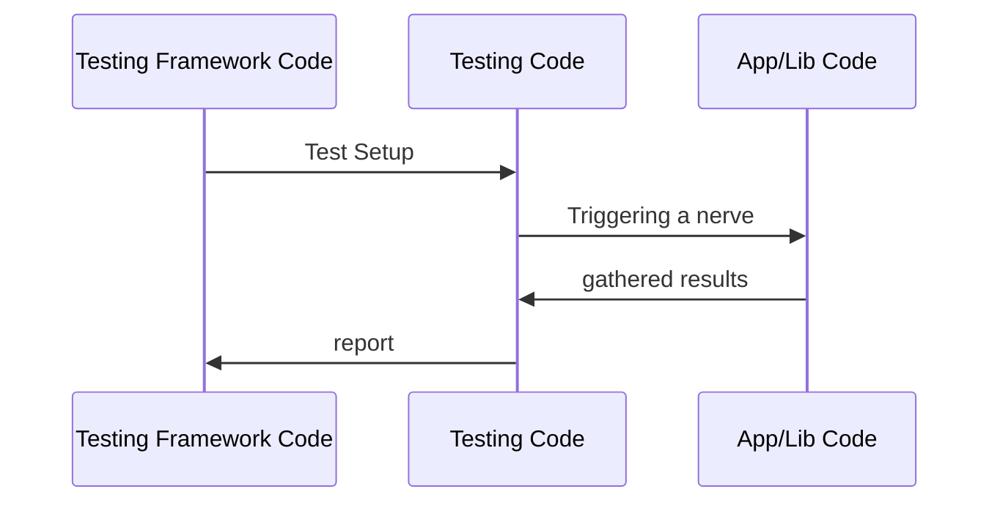
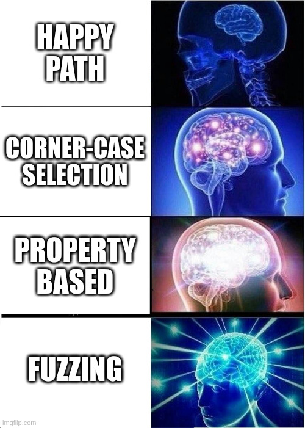

```mermaid
stateDiagram
    direction LR
    classDef testPass color:green,stroke-width:2px
    classDef testFail color:red,stroke-width:2px

    [*] --> pass_tests:::testPass : git pull
    pass_tests --> fail_new:::testFail : implement new test
    fail_new --> pass_new:::testPass : implement new code
    pass_new --> pass_tests_again:::testPass
    pass_new --> pass_new_again:::testPass : (optional) refactor code and/or test
    pass_new_again --> fail_new_again:::testFail : comment implementation
    fail_new_again --> pass_tests_again:::testPass : uncomment implementation
    pass_tests_again --> [*] : git push

```

# Testing 🪙

<!--
- Testing and coding are two sides of the same coin
- All projects have testing, some do it with written code
-->

---
layout: full
---

# Overview

<v-click>

## **Principles**

        1. Testing WHAT?
        2. WHY bother testing?
        3. Testing HOW?

</v-click>
<v-click>

## **Concepts**

        4. Testing Work-flow
        5. Testing Frameworks
        6. Testing Features

</v-click>
<v-click>

## **Practices**

        7. Common Pitfalls
        8. Good Habits

</v-click>

---
layout: section
---

# Testing Principles

---

# Testing WHAT?

Different Targets

<v-click>

1. 📃 **Code**

        (e.g. it doesn't break)

</v-click>
<v-click>

2. 💼 **Requirements**

        (e.g. business is happy)

</v-click>
<v-click>

3. 🖥 **Environments**

        (e.g. deployment to prod works!)

</v-click>
<v-click>

4. 📚 **Data**

        (e.g. dataset is statistically reasonable)

</v-click>

<!--

1. Is code getting slower? is memory usage worse? is coverage good enough? public interface respected?
2. Is code doing what is expected from it?
3. Code is fine, business is happy, but will this work when deployed in production?
4. Statistical testing for datasets

-->

---

# WHY bother testing?

3 Reasons

<v-click>

1. 🐞 To catch **bugs**

        (proves existence, not lack thereof!)

</v-click>
<v-click>

2. 🧑‍💻 To increase developer **confidence**

        (promotes refactoring, hence clean code)

</v-click>
<v-click>

3. 💡 To **share understanding** among engineering team

        (becomes a form of living documentation)

</v-click>

<!--
Understanding your testing suite keeps you connected to your business. Becomes critical in times of "AI vibe coding".
-->

---

# Testing HOW?

Empirically

Unlike **Static Analysis** and **Formal Verification** approaches...

... testing is more **EMPIRICAL** and less **FORMAL**.

[https://se.inf.ethz.ch/~meyer/publications/testing/principles.pdf](https://se.inf.ethz.ch/~meyer/publications/testing/principles.pdf)

<v-click>

        - Business wants to stop spending, regardless of testing

        - The value of testing ∝ The value of the project

</v-click>

---

# Testing HOW?

Automatically

<v-click>

If testing is informal ...

Manual testing is savage *

</v-click>

---

# Testing HOW?

Pragmatically

<Transform :scale="0.69">


</Transform>

---

# Testing HOW?

Touching a code nerve



---
layout: section
---

# Testing Concepts

---

# Testing **Work-flow**

- The **Test Driver**

- The **Feedback Loop**


---

# Test Driver

(Testing Work-flow)

The process driving the testing framework could be ...

<Transform :scale="0.8">

<v-click>

- `python custom_testing_logic.py`

        - A tailored custom python process, legacy, not cool anymore

</v-click>
<v-click>

- `pytest`

        - Works like a charm, specially from PyCharm

</v-click>
<v-click>

- `nox`

        - Multi-python-environment testing

</v-click>
<v-click>

- `containerized shell`

        - Multi-environment testing

</v-click>
<v-click>

- `ci/cd`

        - Already vendor-tainted

</v-click>

</Transform>

---

# Feedback Loop

(Testing Work-flow)

For each new test for a new feature (or bugfix)...




<v-click>

        - ensure you start (and finish) your work from a passing state

</v-click>
<v-click>

        - see your new test fail!

</v-click>
<v-click>

        - specially if you refactored!

</v-click>

<v-click>

        - your CI/CD pipeline should run the rest of your test suite

</v-click>


<!--

save the planet! run locally first, leverage git hooks

should state diagram invert state / transition elements?


-->

---

# Testing **Frameworks**

1. **[doctest](https://docs.python.org/3/library/doctest.html)**

        - nice for python coding interviews ;)

2. **[unittest](https://docs.python.org/3/library/unittest.html)**

        - great python builtin

3. **[pytest](https://docs.pytest.org/en/stable/index.html)**

        - makes testing fun again

---
layout: two-cols-header
---

# doctest

(Testing Frameworks)

::left::

Example

<Transform :scale="0.8">
```python
# factorial.py
def factorial(n):
        """
        Returns the factorial of a number.

        >>> factorial(5)
        120
        >>> factorial(0)
        1
        >>> factorial(3)
        6
        """
        if n == 0:
                return 1
        else:
                return n * factorial(n-1)
```

`python -m doctest -v factorial.py`

</Transform>

::right::

<v-click>

Exercise

1. `git clone https://github.com/eth-cscs/swe4py.git`
1. `cd swe4py/exercises/2-1-testing/01-doctests`
1. Add some doctest tests to `doctest.py`
1. Run those doctest tests and see the results in stdout

</v-click>

---
layout: fact
---

... did you see your test <a class="text-red-600 text-2xl">FAIL</a> ?

---
layout: center
---

# Anatomy of a Test

The 3A (if you like acronyms)

- Arrange
- Act
- Assert

FWIW aka GWT from BDD

---

# unittest

(Testing Frameworks)

<Transform :scale="0.9">

*Example from CPython @ https://github.com/python/cpython/blob/3.9/Lib/test/test_float.py#L566*

```
class FormatFunctionsTestCase(unittest.TestCase):

    def setUp(self):
        self.save_formats = {'double':float.__getformat__('double'),
                             'float':float.__getformat__('float')}

    def tearDown(self):
        float.__setformat__('double', self.save_formats['double'])
        float.__setformat__('float', self.save_formats['float'])

    def test_getformat(self):
        self.assertIn(float.__getformat__('double'),
                      ['unknown', 'IEEE, big-endian', 'IEEE, little-endian'])
        self.assertIn(float.__getformat__('float'),
                      ['unknown', 'IEEE, big-endian', 'IEEE, little-endian'])
        self.assertRaises(ValueError, float.__getformat__, 'chicken')
        self.assertRaises(TypeError, float.__getformat__, 1)
```

Can you see the 3As?

</Transform>

<!--
./python -m test --list-tests | grep float
./python -m test test_float -v
-->

---

# pytest

(Testing Frameworks)

<Transform :scale="0.9">

*Example from Matplotlib @ https://github.com/matplotlib/matplotlib/blob/v3.10.1/lib/matplotlib/tests/test_axes.py#L385*

```
@pytest.mark.parametrize('twin', ('x', 'y'))
def test_twin_units(twin):
    axis_name = f'{twin}axis'
    twin_func = f'twin{twin}'

    a = ['0', '1']
    b = ['a', 'b']

    fig = Figure()
    ax1 = fig.subplots()
    ax1.plot(a, b)
    assert getattr(ax1, axis_name).units is not None
    ax2 = getattr(ax1, twin_func)()
    assert getattr(ax2, axis_name).units is not None
    assert getattr(ax2, axis_name).units is getattr(ax1, axis_name).units
```

Can you see the 3As?

</Transform>

---

# pytest Exercise

Getting Started

<Transform :scale="0.75">

```
# 1. navigate to exercise
git clone https://github.com/eth-cscs/swe4py.git
cd swe4py/exercises/2-1-testing

# 2. create python environment
python -m venv venv
source venv/bin/activate

# 3. install dependencies
pip install pytest

# 4. run all tests
python -m pytest .

# 5. run module tests
python -m pytest test_core.py

# 6. run named tests
python -m pytest -k pal

# 7. run marked tests

"first add a pytest mark named smoking to test_smoke from test_app.py."
python -m pytest -m smoking

# 8. explore pytest options
see https://docs.pytest.org/en/stable/how-to/output.html

```

</Transform>

<!--
- Run test suite with coverage?
- Run test suite in randomized order?
-->

---

# Testing Features

1. Assertions
2. Fixtures
3. Parametrization
4. Mocking

---

# Assertions

(Testing Features)

<v-click>

- Used to check expectations

</v-click>
<v-click>

- At least one for each test

</v-click>
<v-click>

- Not too many for each test

</v-click>
<v-click>

- `self.assertSomething(*args, **kwargs)` in unittests

</v-click>
<v-click>

- plain `assert` in pytest

</v-click>

---
layout: fact
---

`assert` (in code) &ne; `assert` (in test)

---
layout: fact
---

`assert` (in code) is **NOT** for error handling

---
layout: fact
---

uncaught `Error` (in test) is **NOT** a form of testing

---

# Fixtures

(Testing Features)

<v-click>

Reusable blocks of testing code

</v-click>
<v-click>

"Mixins" for class-based unittest examples

</v-click>
<v-click>

"Fixtures" for pytest-based examples

</v-click>

---
layout: two-cols-header
---

# Mixin

Fixture with unittests

::left::

<Transform :scale="0.7">

*Example from CPython @ https://github.com/python/cpython/blob/3.9/Lib/test/test_argparse.py#L48*

```
class TempDirMixin(object):

    def setUp(self):
        self.temp_dir = tempfile.mkdtemp()
        self.old_dir = os.getcwd()
        os.chdir(self.temp_dir)

    def tearDown(self):
        os.chdir(self.old_dir)
        for root, dirs, files in os.walk(self.temp_dir, topdown=False):
            for name in files:
                os.chmod(os.path.join(self.temp_dir, name), stat.S_IWRITE)
        shutil.rmtree(self.temp_dir, True)

    def create_writable_file(self, filename):
        file_path = os.path.join(self.temp_dir, filename)
        with open(file_path, 'w') as file:
            file.write(filename)
        return file_path

    def create_readonly_file(self, filename):
        os.chmod(self.create_writable_file(filename), stat.S_IREAD)
```

</Transform>

::right::

<Transform :scale="0.65">

*later, for usage ...*

```
class TestFileTypeRB(TempDirMixin, ParserTestCase):
    """Test the FileType option/argument type for reading files"""

    def setUp(self):
        super(TestFileTypeRB, self).setUp()
        for file_name in ['foo', 'bar']:
            with open(os.path.join(self.temp_dir, file_name), 'w') as file:
                file.write(file_name)
    ...
```
</Transform>

---

# How Testing Arrange feels like

<Transform :scale="0.8">


</Transform>

---

# Fixture

Fixture with pytest

<Transform :scale="0.99">

*Example from Flask @ https://github.com/pallets/flask/blob/3.1.0/tests/test_config.py#L244*

```
def test_from_pyfile_weird_encoding(tmp_path, encoding):
    f = tmp_path / "my_config.py"
    f.write_text(f'# -*- coding: {encoding} -*-\nTEST_VALUE = "föö"\n', encoding)
    app = flask.Flask(__name__)
    app.config.from_pyfile(os.fspath(f))
    value = app.config["TEST_VALUE"]
    assert value == "föö"
```

</Transform>

---

# pytest Exercise

Assertions and Fixtures

*Search help at https://docs.pytest.org*

1. Write a test with asserts for `is_even` function of `core.py`
1. Implement the tests for `multiply`, fix bugs as needed but see the test fail!
1. Implement tests for `divide` using `pytest.raises`. Test for error message too.
TODO
1. Add a fixture to your test to factor out your test data
1. Move your fixture to `conftest.py` so it can be reused later
1. Add a docstring to your fixture and see the docs with `pytest --fixtures`

---

# Parametrization

1 test * N input combinations = N tests

<v-click>

Your test becomes a function and its parametrized invocations become test instances.

</v-click>
<v-click>

Removes duplication while promoting dynamic test-case generation.

</v-click>
<v-click>

<Transform :scale="0.8">

*Example from Numpy @ https://github.com/numpy/numpy/blob/v2.2.3/numpy/distutils/tests/test_log.py#L23*

```
@pytest.mark.parametrize("func_name", ["error", "warn", "info", "debug"])
def test_log_prefix(func_name):
    func = getattr(log, func_name)
    msg = f"{func_name} message"
    f = io.StringIO()
    with redirect_stdout(f):
        func(msg)
    out = f.getvalue()
    assert out  # sanity check
    clean_out = r_ansi.sub("", out)
    line = next(line for line in clean_out.splitlines())
    assert line == f"{func_name.upper()}: {msg}"
```

</Transform>

</v-click>

---

# Parametrization

(Testing Features)

<Transform :scale="0.5">



</Transform>

<!--

Introducing Fuzzing requires a workflow adjustment and a more complex setup.

Randomized input testing proved to be quite efficient.

These days used a lot in security context for vulnerability checking within penetration testing.

-->

---

# Mocking

(Testing Features)


<v-click>

The **Mock** is the object you replace a real one with to inspect in your test

</v-click>
<v-click>

The **Stub** is the callable you repleace a real function with to prevent being called from your test

</v-click>
<v-click>

**Patching** is the action of "implanting" the mock/stub

</v-click>
<v-click>

`monkeypatch` is the pytest fixture for patching and mocking.

</v-click>

---

# Mocking

Pytest Example

```
def test_getssh(monkeypatch):
    # mocked return function to replace Path.home
    # always return '/abc'
    def mockreturn():
        return Path("/abc")

    # Application of the monkeypatch to replace Path.home
    # with the behavior of mockreturn defined above.
    monkeypatch.setattr(Path, "home", mockreturn)

    # Calling getssh() will use mockreturn in place of Path.home
    # for this test with the monkeypatch.
    x = getssh()
    assert x == Path("/abc/.ssh")
```

More examples in https://docs.pytest.org/en/stable/how-to/monkeypatch.html

---

# pytest Exercise

Parametrization and Mocking

1. use `pytest.mark.parametrize` in `test_count_vowels` to change one test with multiple asserts into multiple tests with one assert each. Run and see the output.

1. Write a test in `test_app.py` that mocks `os.getenv` and makes the function using `os.getenv` fail

---
layout: section
---

# Testing Practices

---

# Common Pitfalls

<v-click>

1. tests < CODE ?

        (tests hold so much value!)

</v-click>
<v-click>

2. integrat**ING** tests

        (don't couple or share state among tests)

</v-click>
<v-click>

3. failed to see the test fail

        (green is cool but have you seen red?)

</v-click>

---

# Good Habits


<v-click>

1. Adjust your code for testability

        (e.g. dependency injection, flags)

</v-click>
<v-click>

2. Keep your tests focused, decoupled and organized

        (e.g. order and functional independence)

</v-click>
<v-click>

3. Tailor your testing workflow

        (e.g. easy to run for first contributors, fast feedback loops,
        unit-tests as default, pre-push hooks, etc.)

</v-click>

---
layout: end
---

# End of Testing section

More about Testing...

**Pandas'** guide: https://pandas.pydata.org/docs/dev/development/contributing_codebase.html#

**Martin Fowler's** posts: https://martinfowler.com/tags/testing.html

**Realpython** tutorials: https://realpython.com/python-testing/

**ETHZ** course: https://video.ethz.ch/lectures/d-infk/2025/spring/263-2815-00L.html
